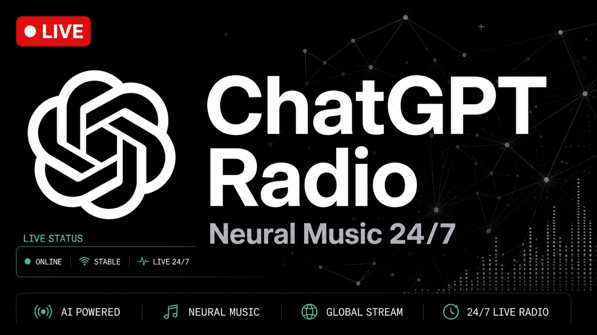
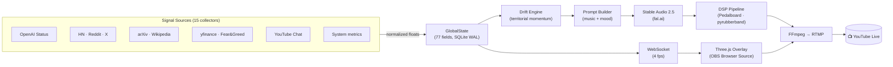

<p align="center">
  <a href="https://www.youtube.com/live/2TmULdve45s">
    
  </a>
</p>

<p align="center">
  <a href="https://www.youtube.com/live/2TmULdve45s"></a>
  &nbsp;
  
  &nbsp;
  
  &nbsp;
  
</p>

---

**ChatGPT Radio** is a 24/7 YouTube live stream where music, visuals, and narration respond in real-time to signals from the OpenAI/AI world — service status, community sentiment, trending research, and market data.

The system has no fixed mood or genre. It is its history of states.

> 🔴 **[Watch live on YouTube →](https://www.youtube.com/live/2TmULdve45s)**

---

## How it works

The stream is driven by a pipeline of real-world signals that flow through a central state machine:



Every element you see and hear is causally traceable to a real signal. If the data stops, the stream freezes — by design.

## Signal sources

| Collector | What it measures |
|-----------|-----------------|
| `openai_status` | OpenAI / ChatGPT service health (RSS) |
| `youtube_chat` | Live chat sentiment + activity rate |
| `hn_algolia` | Hacker News AI story velocity |
| `reddit` | r/MachineLearning · r/singularity sentiment |
| `nitter_rss` | Twitter/X AI keyword momentum |
| `arxiv` | AI paper publication rate |
| `wikipedia` | AI article edit activity |
| `google_trends` | Search interest in AI terms |
| `gdelt` | Global news tone (GDELT project) |
| `hedonometer` | Twitter happiness index |
| `yfinance_proxy` | NVDA · MSFT · AI ETF prices |
| `cnn_fear_greed` | CNN Fear & Greed index |
| `newsapi` | AI news headline volume |
| `media_cloud` | Media coverage intensity |
| `system_metrics` | Stream health (CPU, memory, FPS) |

## Stack

| Layer | Technology |
|-------|-----------|
| Runtime | Python 3.12, asyncio |
| State | Pydantic v2, SQLite WAL (aiosqlite) |
| DSP | Pedalboard, pyrubberband |
| Music | Stable Audio 2.5 (fal.ai) |
| Visuals | Three.js, WebGL, OBS Browser Source |
| Chat | YouTube Live Chat API + GPT-4o-mini |
| Logs | structlog (JSON) |
| Tests | pytest, pyright, ruff |

## Setup

### Prerequisites

- Python 3.12+
- [`uv`](https://github.com/astral-sh/uv) package manager
- FFmpeg with `libx264` and `libmp3lame`
- OBS Studio (for overlay capture)
- A YouTube channel with live streaming enabled

### Install

```bash
git clone https://github.com/chatgptradio/chatgptradio
cd chatgptradio
uv sync
cp .env.example .env
# fill in your API keys (see .env.example)
```

### Run

```bash
uv run python main.py
```

### Tests

```bash
uv run pytest && uv run pyright && uv run ruff check .
```

## Configuration

`config.yaml` controls which collectors are active and their polling intervals. Each collector is independent — disabling one never crashes the stream.

All credentials go in `.env` (see [`.env.example`](.env.example)).

## The NO FAKE contract

Every visual element must be traceable to a real data signal. If `GlobalState` freezes, the overlay must freeze.

- **Allowed** — lerp toward a data-driven target, signal-gated oscillators (`sin(t) * signal`), time that only advances when signals are active
- **Forbidden** — `sin(time * constant)` as a primary motion source, `Math.random()` in animation loops, oscillators independent of `GlobalState`

Full specification: [`overlays/NO_FAKE.md`](overlays/NO_FAKE.md)

## Architecture decisions

Key design choices are documented as ADRs in [`docs/adr/`](docs/adr/):

- [ADR-0001](docs/adr/0001-global-state-source-of-truth.md) — GlobalState as single source of truth
- [ADR-0002](docs/adr/0002-no-hardcoded-constants.md) — No hardcoded constants in drift/self-model
- [ADR-0003](docs/adr/0003-sqlite-wal.md) — SQLite WAL for persistence
- [ADR-0004](docs/adr/0004-no-langgraph.md) — Pure asyncio, no orchestration framework
- [ADR-0005](docs/adr/0005-single-db-connection.md) — Single shared DB connection
- [ADR-0006](docs/adr/0006-fal-stable-audio.md) — Stable Audio 2.5 via fal.ai
- [ADR-0007](docs/adr/0007-emotion-synthesis.md) — Emotion synthesis from raw signals

## Contributing

### Adding a collector

1. Create `collectors/my_source.py` with an async `collect(state, updater)` function
2. Register it in `config.yaml` under `collectors:`
3. Add the new fields to `GlobalState` in `core/state.py`
4. Write tests in `tests/test_collector_my_source.py`

A collector that fails must set `source_health["my_source"] = False` and return — it must never crash the main process.

## Related

- [ChatGPT](https://chatgpt.com) · [OpenAI](https://openai.com) · [X / Twitter](https://x.com/OpenAI)
- [Watch live on YouTube](https://www.youtube.com/live/2TmULdve45s)

## License

MIT — see [LICENSE](LICENSE)
